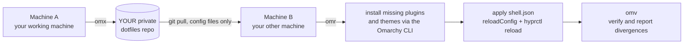

# omarchy-desktop-sync

[](https://github.com/ozz1ee-dev/omarchy-desktop-sync/actions/workflows/lint.yml)

**A deployment guide (plus a reference implementation) for mirroring your whole Omarchy
desktop - bar layout, widget order, which plugins are enabled, themes, keybinds, menu -
between your own machines, with one command each way.**

```
omx    # on the machine you are working on: publish the desktop state
omr    # on any other machine: pull it, install what is missing, apply the state
omv    # any time: audit - does this machine still match your repo?
```

## What this repository is (and is not)

| It is | It is not |
|---|---|
| A written guide: why a naive dotfiles repo fails, and the four rules that fix it | A sync service: nothing here talks to your machines |
| A **reference implementation** (`reference/bin/`) you copy into your own setup | A supported product line with a release cadence |
| Templates you adapt (`templates/`) and hard-won notes (`docs/`) | A place to store anybody's configuration |
| Tested on a real two-machine setup (aarch64 + x86_64, Omarchy Quattro) | Something to point your `yadm` at "because it exists" |

**This repository stores no user data.** There is no config, no manifest, no `shell.json`, no
plugin list and no theme list in here - only instructions, scripts and empty templates. Your
desktop lives in **your own private repo**, which you create in step 1 of the guide below.
Never commit your config here, and never push to this repo.

It is also not intended as production infrastructure: you install the tools into your own
account, they act on your own files, and you are the one who tests them on your machines
(`omv` exists exactly for that). Treat it as a documented recipe, not as a service.

## Why copying `~/.config` does not work

An Omarchy desktop is not a folder of text files. It is four different things:

| What | Where it lives | Why copying files is not enough |
|---|---|---|
| Bar layout, widget order, **which plugins are enabled** | `~/.config/omarchy/shell.json` | single source of truth, applied by Quickshell via `reloadConfig` |
| Plugins | one git clone per plugin in `~/.config/omarchy/plugins/<id>/` | the directories **are** git repositories - putting them into another git repo records empty gitlinks |
| Themes | one git clone per theme in `~/.config/omarchy/themes/<slug>/` | same, plus a theme can be installed but *hollow* (no wallpapers) |
| Keybinds, Hyprland behaviour | `~/.config/hypr/*.lua`, `*.conf` | `monitors.lua` is machine-specific and must not travel |

So a naive dotfiles repo either drags hundreds of megabytes of vendored plugin code with it, or
it silently loses everything that makes the desktop *yours*: the enabled/disabled state, the bar
layout, the small tweaks you made to two plugins.

## The design, in four rules

1. **The repo carries only what cannot be downloaded.** Text config, plus two manifests
   (`plugins.txt`, `themes.txt`) that say *where to get* plugins and themes, plus small patches
   for plugins you modified locally.
2. **`shell.json` decides what is enabled and where it sits.** It travels as a file and the
   receiving machine applies it. Nothing in the install path may write to it - only Quickshell
   owns that file.
3. **The receiving machine installs, it does not copy.** Missing plugins come from
   `omarchy plugin add`, missing themes from `omarchy theme install`, then the state from
   `shell.json` is applied and the shell is reloaded.
4. **One generated report.** `INVENTORY.md` (written on every publish) describes the desktop in
   plain language, so your private repo is readable without cloning anything.



## Requirements

- Omarchy (Arch-based, Hyprland + Quickshell) on both machines. The guide was written and tested
  on Omarchy Quattro, aarch64 and x86_64.
- `yadm` (`sudo pacman -S yadm`), `git`, `python3`.
- A git identity, because the tool commits for you:
  `git config --global user.name "You" && git config --global user.email "you@example.com"`.
- An **empty private repo** to hold your config (GitHub/GitLab). Public works too, but then your
  config is public - the guide assumes private.

## Deployment guide

### Part A - the machine you want to copy FROM

```bash
# 1. get this guide (public; fork it if you like - then clone YOUR fork instead)
git clone https://github.com/ozz1ee-dev/omarchy-desktop-sync.git omarchy-desktop-sync
cd omarchy-desktop-sync

# 2. install the tools into ~/.config/omarchy-desktop, seed templates, wire omx/omr/omv
#    --repo is YOUR OWN empty private repo (GitHub, GitLab, Codeberg, self-hosted - any host)
./install.sh --repo <your-private-config-repo-url>

# 3. adopt the current desktop into your repo
yadm init
yadm remote add origin <your-private-config-repo-url>
omx
```

Two notes on step 1: the second argument pins the directory name, so `cd omarchy-desktop-sync`
works even if your fork is called something else. And the only repo this guide knows about is
itself - the config repo in steps 2-3 is yours, never one of ours (`omarchy-config` style URLs
are examples).

Example, with a private repo you created a moment ago:

```bash
git clone https://github.com/ozz1ee-dev/omarchy-desktop-sync.git omarchy-desktop-sync
cd omarchy-desktop-sync
./install.sh --repo https://github.com/your-name/my-omarchy-config.git
yadm init
yadm remote add origin https://github.com/your-name/my-omarchy-config.git
omx
```

`install.sh` never overwrites silently: an existing file is kept and the new version lands next
to it as `<name>.new` (use `--force` to replace). Flags: `--repo <url>`, `--force`,
`--no-aliases`, `--uninstall`.

Before the first publish, open `~/.config/omarchy-desktop/tracked.paths` and decide what should
travel - it starts with a small, commented set on purpose.

### Part B - every other machine

```bash
sudo pacman -S yadm git
yadm clone --bootstrap <your-private-config-repo-url>
```

`--bootstrap` runs `import.sh` for you: missing plugins and themes are installed through the
Omarchy CLI, local patches are applied, `shell.json` is applied, the shell reloads, and the run
ends with the audit. First run on a fresh machine downloads every theme, so give it time and
disk.

### Part C - daily use

| Command | What it does |
|---|---|
| `omx` | publish this machine's desktop (manifests, patches, `INVENTORY.md`, commit, push) |
| `omr` | fetch and apply the desktop from your repo (import + verification) |
| `omv` | read-only audit: registry vs manifests vs `shell.json`, shell health, theme completeness, patches applied |

### Part D - verifying a machine

```bash
omv
```

Exit code 0 means this machine matches your repo; 1 means divergence, with the reasons listed.
Run it after any import, and any time the desktop "feels wrong". Example report and how to read
it: [docs/troubleshooting.md](docs/troubleshooting.md).

### Part E - backing out

```bash
~/.config/omarchy-desktop/bin/setup-shell.sh --remove   # unwire the aliases
./install.sh --uninstall                                # same, plus the reminder of what to delete
rm -rf ~/.config/omarchy-desktop                        # the tools (your private repo is untouched)
```

Nothing here modifies Omarchy itself: the tools only read and write files under `$HOME`.

## What travels, what does not

| Travels (`omx` -> `omr`) | Stays local on purpose |
|---|---|
| `shell.json` - bar layout, widget order, enabled/disabled state | `~/.zshrc` / `~/.bashrc` (the alias block is added by `setup-shell.sh`) |
| `plugins.txt`, `themes.txt`, `active-theme` | `~/.config/hypr/monitors.lua` (per-machine monitor layout) |
| `~/.config/omarchy/{extensions,hooks,branding,defaults,...}` | generated files such as `omarchy-workspace-layout.lua` |
| `~/.config/hypr/*.lua` except `monitors.lua` | API keys, passwords, OAuth tokens, keyring entries |
| `patches/*.patch` - your local plugin edits | runtime state under `~/.local/state/omarchy/` |
| the tools themselves and `INVENTORY.md` | the wallpaper you picked |

## What is in this repository

```
README.md                 this guide
install.sh                installs the reference tools into ~/.config/omarchy-desktop
reference/bin/            the reference implementation (copy it into your own setup)
templates/                starter files: tracked.paths, dotfiles-gitignore, aliases.zsh,
                          yadm-bootstrap, manual.md, settings.example
docs/how-it-works.md      the mechanics: manifests, shell.json semantics, publish/import steps
docs/pitfalls.md          12 lessons from a real two-machine setup (read this one)
docs/troubleshooting.md   symptom -> cause -> fix, plus diagnostics recipes
.github/workflows/        lint: bash -n, shellcheck, embedded-python parse
```

Installed layout (what `install.sh` creates and your private repo then carries):

```
~/.config/omarchy-desktop/
  bin/                    the tools (copied from reference/bin/)
  tracked.paths           what travels; edit this
  plugins.txt themes.txt  manifests, generated on every publish
  active-theme            which theme should be active
  patches/                your local plugin edits, generated
  INVENTORY.md            generated report of the source machine
  settings                DOTFILES_REPO
  aliases.zsh manual.md .gitignore
~/.config/yadm/bootstrap  runs import.sh at the end of `yadm clone --bootstrap`
```

## Commands

```
reference/bin/export.sh  [--dry-run] [--no-push]                    publish  (alias omx)
reference/bin/pull.sh    [--repo] [--no-import] [--keep-untracked]
                         [--restart-shell] [--dry-run]              receive  (alias omr)
reference/bin/import.sh  [--dry-run] [--themes-only] [--repair-themes] [--only-enabled]
                         [--skip-themes] [--skip-patches] [--skip-shell] [--restart-shell]
reference/bin/verify.sh                                             audit    (alias omv)
reference/bin/inventory.sh                                          regenerate INVENTORY.md
reference/bin/plugin-update.sh [--list-dirty] [--with-patches] [--clean-junk] [--fix-perms]
reference/bin/setup-shell.sh   [--remove] [--dry-run]               wire/unwire the shell block
reference/bin/theme-doctor.sh                                       per-theme report
install.sh               [--repo <url>] [--force] [--no-aliases] [--uninstall]
```

Worth knowing: `--themes-only --repair-themes` (reinstall hollow themes), `--restart-shell`
(relaunch Quickshell when it keeps stale state), `--keep-untracked` (inspect file collisions
before they are moved aside), `--no-push` (commit locally only), `--list-dirty` (why a plugin
refuses to update).

## Configuration

`~/.config/omarchy-desktop/settings` (created by `install.sh`, then carried by your repo):

```bash
DOTFILES_REPO="https://github.com/your-name/my-omarchy-config.git"
```

Everything else is generated: `plugins.txt`, `themes.txt`, `active-theme`, `patches/`,
`INVENTORY.md`. Edit `tracked.paths` to change what travels.

## Troubleshooting

The most common ones (full list: [docs/troubleshooting.md](docs/troubleshooting.md)):

| Symptom | Cause and fix |
|---|---|
| `error: The following untracked working tree files would be overwritten by merge` | a file is new in the repo while a local untracked copy exists. `pull.sh` handles it: local copies move to `backups/untracked-<ts>/`, nothing is deleted. `--keep-untracked` shows them first. |
| `cannot pull with rebase: You have unstaged changes` | local edits in synced files. `pull.sh` autostashes; `--repo` lets the repo win. |
| Plugin updater refuses: `Dirty, untracked or ignored files present` | that message comes from the panel plugin manager, which demands a byte-identical directory. Use `plugin-update.sh`. |
| A theme loads without wallpaper and is missing from the picker | hollow theme (no `backgrounds/`). `import.sh` repairs this automatically. |
| The bar keeps the old layout after `omr` | Quickshell held state in memory: `omr --restart-shell`. |
| `Git repo does not exist` from `yadm` | that machine was never cloned: `yadm clone --bootstrap <url>`. |

## Scope and non-goals

- Not a hosted service, not a daemon, no telemetry, no network calls except `git` and the
  Omarchy CLI.
- Not a backup: it mirrors configuration, not data. Secrets are out of scope by design
  (`manual.md` lists what to redo by hand).
- Not authoritative for your machine: you own the private repo, the tracked list and the review
  of every publish. The tools try hard to avoid data loss (collisions are moved aside, nothing
  is deleted, `verify.sh` only reports) but you are responsible for what you commit.
- Bugs in Omarchy core, plugins or themes belong upstream - this repository only drives their
  documented CLIs.

## Credits

Built on [Omarchy](https://omarchy.org) and [yadm](https://yadm.io). The plugin model
(manifests, `kinds`, `shell.json` as the enabled-state source of truth) is documented in
`/usr/share/omarchy/shell/README.md` and `shell/services/PluginRegistry.qml` - reading those two
files is the fastest way to understand any behaviour described here.

## License

MIT - see [LICENSE](LICENSE).
